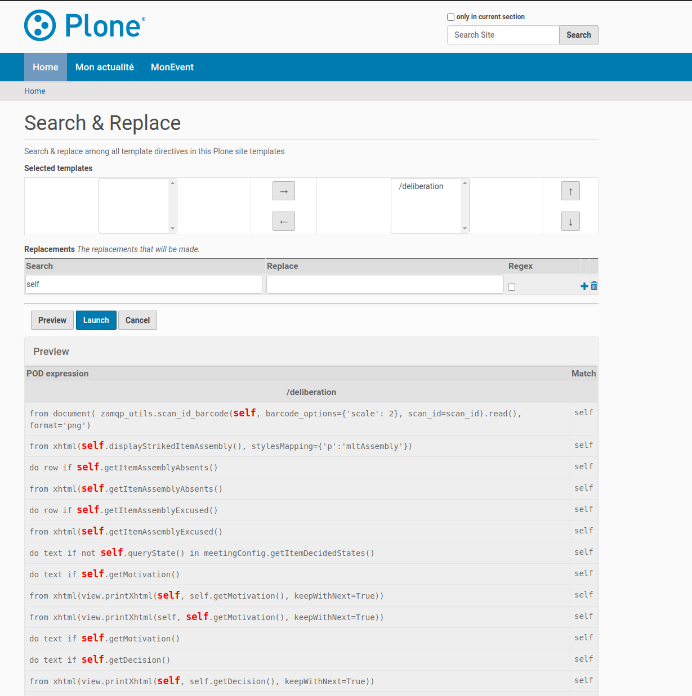

Search & replace feature
=========================
The search & replace feature is aimed at site administrators or developers
that have to maintain a lot of templates in their Plone site.

It is used to search and replace **POD expression only** inside the POD templates. In other words,
it will not search & replace in the odt "text" per say.

At the current time, it is not possible to use it on POD Templates that use .ods file
but might be in the future.

Also, it is not possible to use it with POD expression stored in "Track-changed text" because of the
way theses expressions are stored inside the XML of the odt file. We might provide a way to convert theses to "Input field" so they can be managed nevertheless.

Command line interface
----------------------

When installing collective.documentgenerator a new bin/search_replace script is added to your bin
directory.

You can use it to search in .odt files stored on the filesystem like this:

.. code::

   $ bin/search_replace "whatISearch" ./my_folder_with_some_templates -r

To replace in the .odt files :

.. code::

   $ bin/search_replace "whatISearch" --replace "whatWillBeReplaced" ./my_folder_with_some_templates -r

To replace and store the new odt result elsewhere:

.. code::

   $ bin/search_replace "whatISearch" --replace "whatWillBeReplaced" ./my_folder -r -d ./my_folder_with_new_templates

Output of ``bin/search_replace -h`` :

.. code::

    usage: utils.py [-h] [--replace REPLACE] [-d TARGET_DIR] [-v] [-i] [-r] [-s]
                    [-E]
                    find_expr [filenames_expr [filenames_expr ...]]

    Search and replace in comments and input fields of .odf files

    positional arguments:
      find_expr
      filenames_expr

    optional arguments:
      -h, --help            show this help message and exit
      --replace REPLACE
      -d TARGET_DIR, --target_dir TARGET_DIR
      -v, --verbose         increase output verbosity
      -i, --ignorecase
      -r, --recursive
      -s, --silent
      -E, --extended-regexp

Code usage
----------

Maintaining a lot of template can be tedious, especially if your api has to change.

You can use the ``SearchAndReplacePODTemplates`` context manager inside your migrations to manage this.

.. code::

    from collective.documentgenerator.search_replace.pod_template import SearchAndReplacePODTemplates
    ...
    with SearchAndReplacePODTemplates([podtemplate_obj]) as search_replace:
        search_results = search_replace.search('WhatISearch')
        replace_results = search_replace.replace('^WillBeReplaced$', 'ByThis', is_regex=True)

The pod_templates will be persisted in the blobstorage at the exit of the context manager.

You can also be creative depending of your use case(s) and do conditional replace(s)
inside the context manager, for example :

.. code::

    from collective.documentgenerator.search_replace.pod_template import SearchAndReplacePODTemplates
    ...
    with SearchAndReplacePODTemplates(podtemplates=(podtemplate_obj1, podtemplate_obj2)) as search_replace:
        search_results = search_replace.search('WhatISearch')
        # search_results is dict with podtemplates UID as key
        # and a list of 'SearchReplaceResult' as value
        for result in search_results.get(podtemplate_obj.UID(), []):
            # result is a namedtuple 'SearchReplaceResult' with theses properties :
            # pod_expr, match_start, match_end, match, node_type, new_pod_expr
            # since we are only searching, new_pod_expr will be null
            if "do text" in result.pod_expr:
                # warning : replace will replace everywhere and is not aware of the if condition above
                # so you have to be specific with what will be replaced
                my_new_pod_expr = result.pod_expr.replace("this", "that")
                search_replace.replace(result.pod_expr, my_new_pod_expr)

GUI (control panel)
-------------------

There is a new control panel available for administrators at "/@@collective.documentgenerator-searchreplacepanel".
You access this new control panel via the collective.documentgenerator control panel in "Site setup".

You can use it to search (or replace) directly on all of your podtemplates site:

