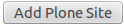
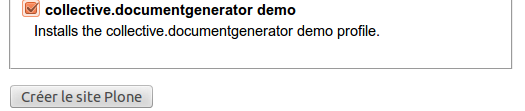

Technical part
==============

Setup
-----

This product is setuped by buildout.

Once you get the product on your computer, you can easily install it by using the Makefile.

Just execute the following command on your /path-To-Your-Documentgenerator-Directory/collective.documentgenerator

.. code::

    make

Or you can also make it by yourself using:

.. code::

    $ python-2.7 bootstrap.py
    $ bin/buildout
    $ bin/instance fg

Once your instance is running, you can find it at *localhost:8080/*

The first thing to do in your brand new instance is to create a new plone site.

Just go to the ZMI (using *localhost:8080/manage_main* and click on the *add new plone site*
in the top right corner of the screen.

Name it the way you want. The important part is that you choose the collective.documentgenerator
demo profile in the list of available products. Check it then click on the *create plone site*
button in the bottom part of the screen.

